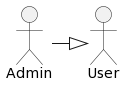
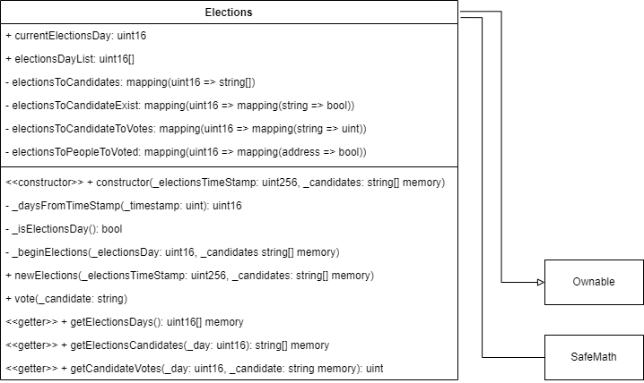

# SmartContract: Sistema de votación digital

## Índice

- [SmartContract: Sistema de votación digital](#smartcontract-sistema-de-votación-digital)
  - [Índice](#índice)
  - [Introducción](#introducción)
  - [Fases de desarrollo](#fases-de-desarrollo)
    - [Análisis](#análisis)
      - [Requisitos funcionales](#requisitos-funcionales)
      - [Requisitos no funcionales](#requisitos-no-funcionales)
      - [Actores y casos de uso](#actores-y-casos-de-uso)
        - [Actores](#actores)
        - [Casos de uso](#casos-de-uso)
          - [Casos de uso de User](#casos-de-uso-de-user)
          - [Casos de uso de Admin](#casos-de-uso-de-admin)
    - [Diseño](#diseño)
      - [Datos](#datos)
      - [Funciones](#funciones)
      - [Modificadores](#modificadores)
      - [Eventos](#eventos)
      - [Contratos Inteligentes de terceros](#contratos-inteligentes-de-terceros)
      - [UML](#uml)
    - [Implementación](#implementación)
    - [Pruebas](#pruebas)
  - [Trabajo futuro](#trabajo-futuro)

## Introducción

Este documento presenta un contrato inteligente diseñado para administrar procesos electorales de manera transparente y segura. Esta solución tiene como objetivo facilitar elecciones justas y sin intermediarios.

## Fases de desarrollo

### Análisis

#### Requisitos funcionales

A continuación se detallan los requisitos funcionales del contrato:

- **Registro de candidatos**: El contrato permite registrar candidatos, incluyendo sus nombres, para su participación en las elecciones.
- **Emisión de votos**: Los votantes pueden emitir sus votos de manera segura y verificable.
- **Recuento de votos**: El contrato  proporciona resultados de las elecciones en tiempo real a medida que se emiten los votos.
- **Gestión de días electorales**: El contrato permite gestionar diferentes días de elecciones, adecuado para múltiples elecciones.
- **Auditoría de candidatos**: El contrato proporciona verificación eficiente de candidatos y su elegibilidad.

#### Requisitos no funcionales

El uso de blockchain en este contrato conlleva las siguientes ventajas que establecemos como los requisitos no funcionales:

- **Inmutabilidad**: Los registros de votos y candidatos son inmutables una vez que se almacenan en la cadena de bloques, lo que garantiza la integridad de los resultados electorales.

- **Transparencia**: Los datos y procesos electorales se almacenan en una cadena de bloques pública y accesible. Cualquier parte interesada puede verificar y auditar los resultados, lo que aumenta la confianza en el proceso.

- **Eliminación de intermediarios**: Al utilizar contratos inteligentes, se eliminan intermediarios y se automatizan los procesos electorales, lo que reduce los costos y posibles fuentes de error.

- **Accesibilidad**: Los votantes pueden emitir sus votos desde cualquier parte del mundo con acceso a internet, lo que aumenta la accesibilidad y la participación en las elecciones.

- **Integridad de los candidatos**: Los candidatos y su elegibilidad se pueden verificar de manera más eficiente, reduciendo el riesgo de candidaturas fraudulentas.

- **Resultados en tiempo real**: Los resultados electorales se generan en tiempo real a medida que se emiten los votos, lo que agiliza el proceso y proporciona resultados más rápidos y confiables.

#### Actores y casos de uso

##### Actores

Se distinguen dos tipos de actores:

- `User`: Usuario sin privilegios de la aplicación. En este caso, corresponde a los votantes de las elecciones.
- `Admin`: Usuario privilegiado de la aplicación. En este caso, se corresponder con el propietario del contrato inteligente.
  

##### Casos de uso

###### Casos de uso de User

- **Ver día de elecciones actual**: Permite a los usuarios ver la fecha del día de elecciones actual. Esto les proporciona información sobre cuándo están ocurriendo las elecciones.
- **Ver historial de días de elecciones**: Ofrece a los usuarios una lista de los días de elecciones pasados y el día de las actuales. Esto permite un seguimiento histórico de las elecciones que han tenido lugar.
- **Ver entrada del historial de días de elecciones**: Permite a los usuarios recuperar la fecha de elecciones en una posición concreta del historial.
- **Emitir voto**: Permite a los votantes para emitir sus votos, los cuales se registran y cuentan en las elecciones.
- **Ver votos de un candidato en unas elecciones**: Proporciona información sobre la cantidad de votos que un candidato específico ha recibido en un día de elecciones particular.
- **Ver listado de candidatos en unas elecciones**: Permite a los usuarios acceder a la lista de candidatos que participan en un día de elecciones específico. 
- **Ver propietario del contrato**: Muestra quién es el propietario actual del contrato. Esto es importante para verificar la autoridad y la administración del contrato.

###### Casos de uso de Admin

- **Iniciar nuevas elecciones**: Permite al propietario del contrato cambiar la fecha del día de elecciones actual, permitiendo establecer la fecha de las nuevas elecciones.
- **Cambiar propietario del contrato**: Permite al propietario actual del contrato transferir la propiedad del contrato a otra entidad.

### Diseño

#### Datos

- `currentElectionsDay`: Almacena el día de elecciones actual en forma de un número entero de 16 bits (`uint16`). Se utiliza como indentificador del día de elecciones y tambien sirve para comprobar la validez de las acciones en función de cuando estas son realizadas. Se calcula mediante la conversión del _timestamp_ de la fecha del día de las elecciones en formato UNIX (segundos transcurridos desde el 1 de enero de 1970).
- `electionsDayList`: Arreglo dinámico de los días de elecciones pasados y/o actual. Proporciona un historial de días de elecciones.
- `electionsToCandidates`: Mapeo que asocia cada día de elecciones (identificado por un número entero de 16 bits) con una lista de candidatos que compiten en ese día específico.
- `electionsToCandidateExist`: Mapeo que permite verificar la existencia de un candidato en un día de elecciones específico. Está diseñado para evitar votos por candidatos inexistentes.
- `electionsToCandidateToVotes`: Mapeo que relaciona días de elecciones con candidatos y la cantidad de votos que han recibido en ese día.
- `electionsToPeopleToVoted`: Mapeo que rastrea las direcciones de las personas que han votado en días de elecciones específicos, lo que evita que un votante emita múltiples votos en la misma elección.

#### Funciones

- `constructor`: Constructor del contrato que se ejecuta una vez al ser desplegado. Inicializa el contrato con los candidatos y la fecha de las elecciones.
- `_daysFromTimeStamp`: Función interna que extrae los datos correspondientes al número de día de un _timestamp_ UNIX.
- `_isElectionsDay`: Función interna que verifica si el día actual corresponde a un día de elecciones, basándose en la fecha actual y la fecha de inicio de las elecciones.
- `_beginElections`: Función interna que inicia un nuevo día de elecciones, registrando los candidatos que compiten en ese día y actualizando el día de elecciones actual.
- `newElections`: Permite al propietario del contrato comenzar un nuevo día de elecciones en una fecha específica. Se utiliza para programar y preparar nuevas elecciones.
- `vote`: Permite a los votantes emitir su voto por un candidato en el día de elecciones actual. También registra que una persona ha votado para evitar votos duplicados.
- `getElectionsDays`: Devuelve una lista de los días de elecciones pasados y/o actual, lo que proporciona un historial de elecciones.
- `getElectionsCandidates`: Permite obtener una lista de candidatos que compiten en un día de elecciones específico.
- `getCandidateVotes`: Permite obtener la cantidad de votos que ha recibido un candidato en un día de elecciones específico.

#### Modificadores

- `onElectionsDay`: Verifica que el día actual sea un día de elecciones antes de permitir que se ejecute una función.
- `onNotElectionsDay`: Verifica que el día actual no sea un día de elecciones antes de permitir que se ejecute una función.
- `voterDidNotVote`: Verifica si el remitente (votante) no ha votado en el día de elecciones actual antes de permitir que se ejecute una función. Evita votos duplicados.
- `candidateExists`: Verifica que el candidato mencionado en una función existe en el día de elecciones especificado antes de permitir que se ejecute la función. Previene consultas y votos por candidatos inexistentes.

#### Eventos

- `changeElectionsDay`: Evento que se activa al realizar un cambio de la fecha de elcciones.

#### Contratos Inteligentes de terceros

La aplicación interactúa con los siguientes contratos:

- `safemath.sol`: Utilizado para realizar cálculos de forma segura y evitar desbordamientos u otros problemas.
- `ownable.sol`: Utilizado para gestionar de forma sencilla las acciones que requieren permisos privilegiados.

#### UML

### Implementación

Para la implementación de este contrato inteligente se han empleado tres ficheros:

- `ownable.sol`: Utilizado para heredar del contrato Ownable.
- `safemath.sol`: Utilizado para realizar cálculos seguros con los tipos de datos de naturaleza matemática.
- `elections.sol`: Nuestro propio contrato, en el cual se implementan todas las funcionalidades descritas el el apartado de [Diseño](#diseño).

Comentarios:
- Se han documentado todas las funciones según el estándar [natspec](<https://docs.soliditylang.org/en/latest/natspec-format.html>).
- Se ha proporcionado mensajes descriptivos a las funciones `require()`.
- Se prestó especial atención en la nomenclatura de los nombres de variables y funciones.
- Se intentó utilizar, en la medida de lo posible, los tipos de datos más pequeños posibles.
- Se intentó utilizar los modificadores de visibilidad y acceso más adecuados según la naturaleza de la función.

### Pruebas

Las pruebas del contrato inteligente se realizaron de forma manual con la ayuda de la herramienta [Remix - Ethereum IDE](<https://remix.ethereum.org/>).

Se realizaron las siguientes pruebas:
- Despliegue del contato.
- Funcionamiento correcto de los _getters_.
  - Actualización correcta de la fecha de elecciones actual.
  - Actualización correcta de la lista de votantes de las elecciones actuales.
- Funcionamiento correcto de las funciones que requieren privilegios altos.
  - Posibilidad de ser utilizadas por el dueño del contrato.
    - Posibilidad de cambiar de dueño del contrato.
    - Posibilidad de cambiar la fecha de elecciones actual.
  - Imposibilidad de ser utilizadas por un usuario común.
- Funcionamiento correcto de las funciones que comprueban la fecha.
- Visualización de los mensajes de error de las funciones `require()`.
- Comprobación adecuada de la existencia de un candidato.
- Imposibilidad de un usuario de votar dos veces en las mismas elecciones.
- Correcto funcionamiento del recuento de votos en elecciones actuales y pasadas.

## Trabajo futuro

Ideas de mejora:
- Creación de una GUI para interactuar con el contrato mediante una aplicación Web.
- Creación de más eventos que puedan resultar de interés.
- Nuevas funcionalidades para gestión de candidatos.
- Nuevas funcionalidades para gestión de fechas de elecciones.
- Nuevas funcionalidades para gestión de votantes.